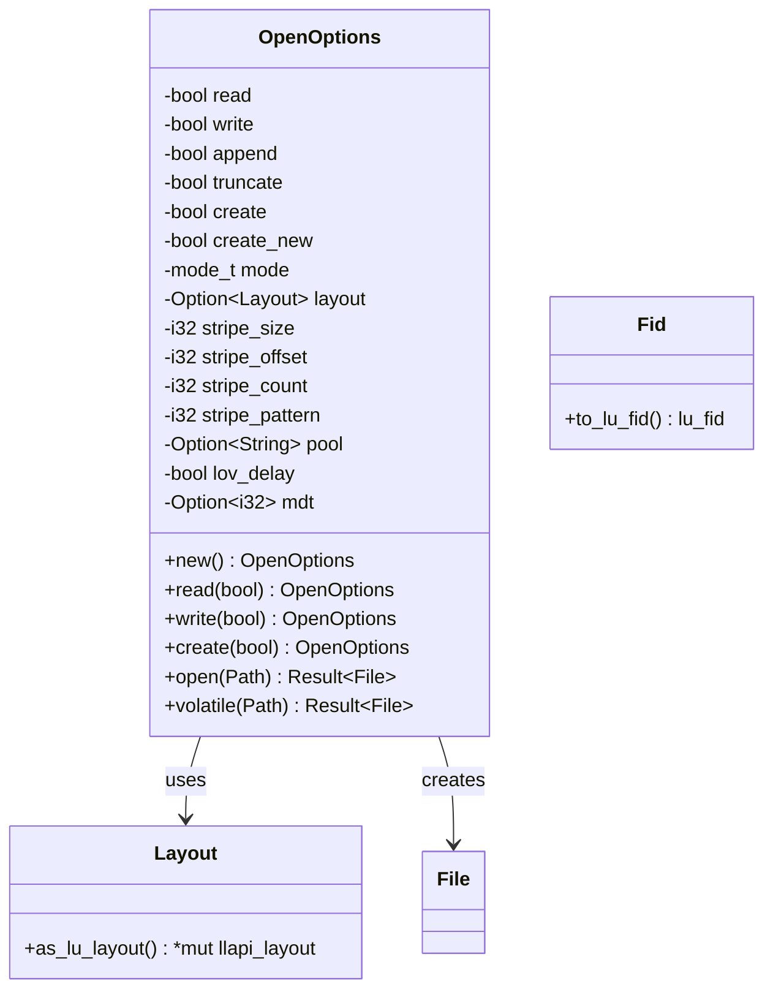
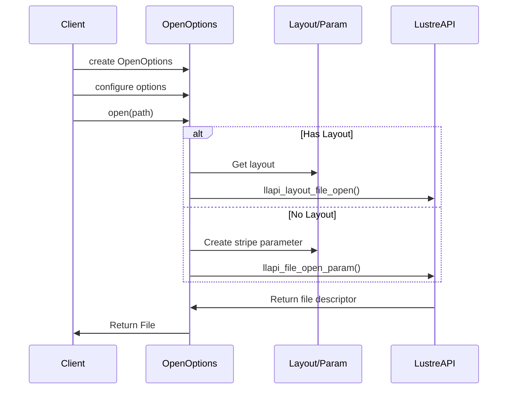
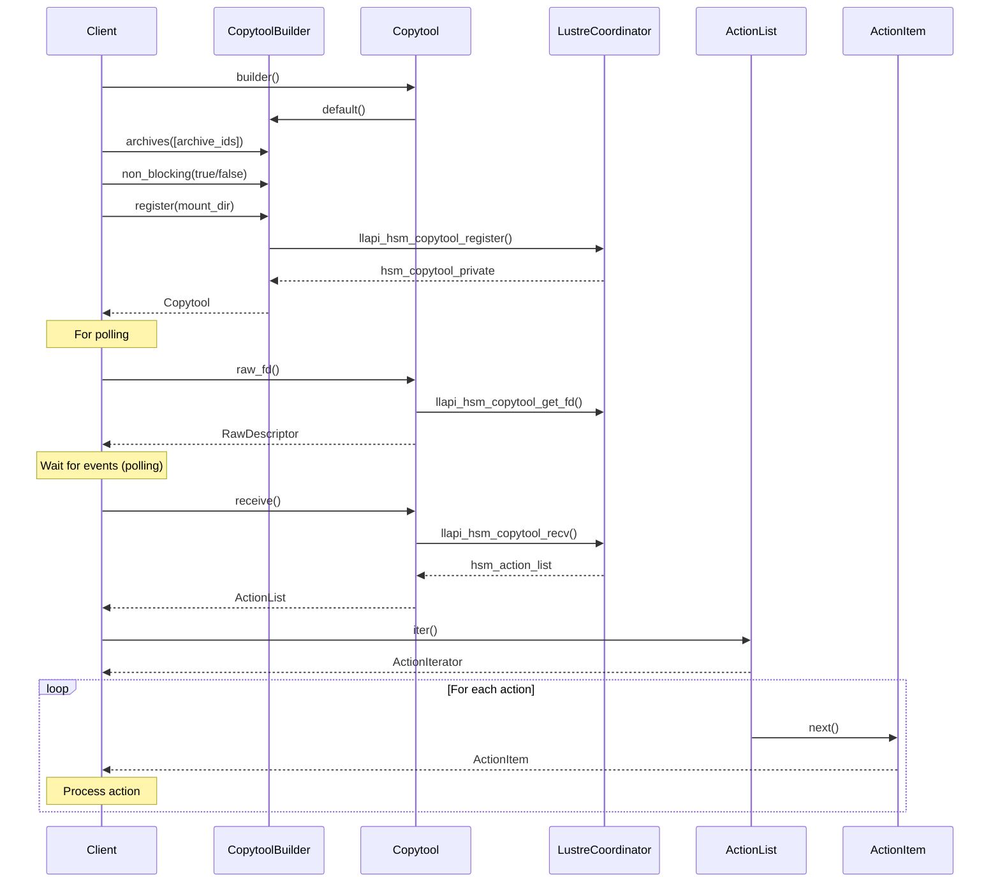
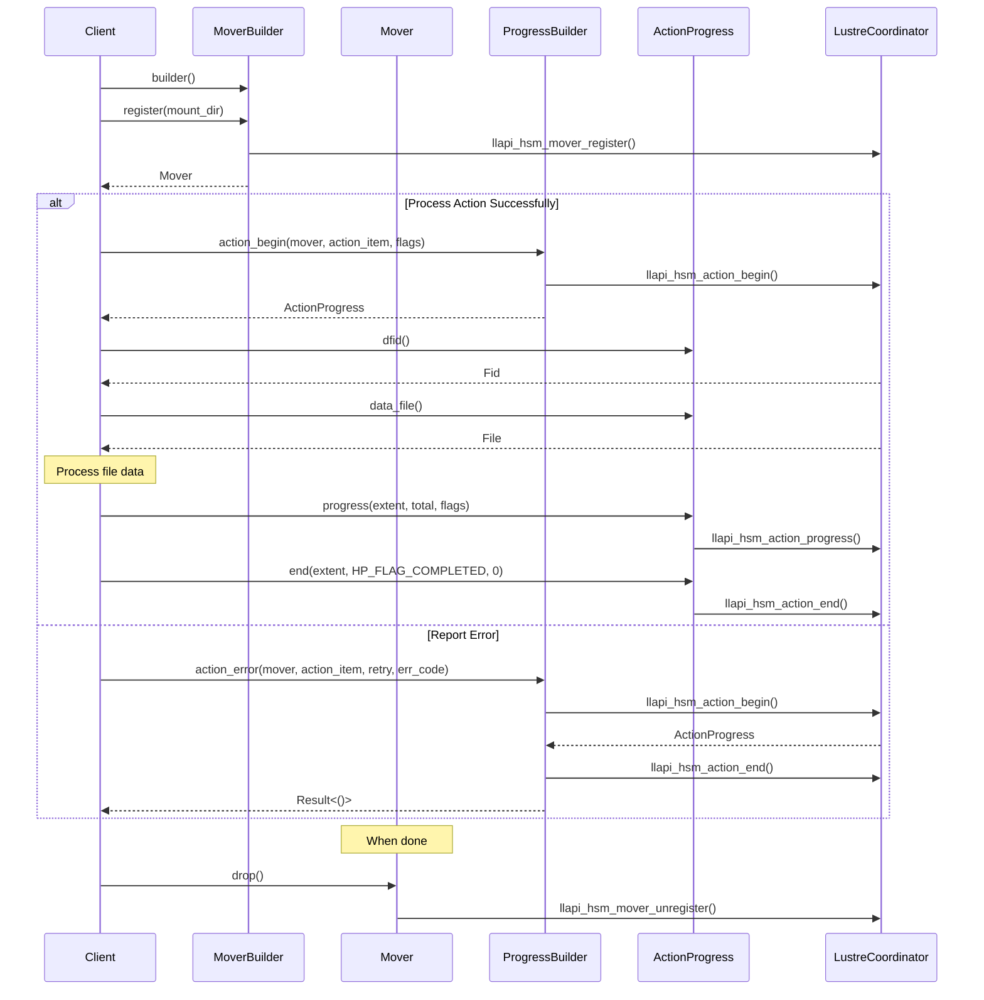

# `rustreapi`

## Creating Files

### `OpenOptions`

## Opening a File

A sequence diagram of the file open process:

## HSM Copytool

This API divides the `lustreapi` copytool into two parts.

- Receive action lists from the Coordinator
- Process actions and send result to the Coordinator

### Receiving Actions

The `Copytool` object wraps a connection to the `HSM` coordinators in each of
the `MDTs.` If the non-blocking option is used when creating the `Copytool,`
then the `raw_fd` can be used to poll in asynchronous code. The `receive()`
method must still be used to fetch the actions, and it will return `EWOUDLBLOCK`
when there are no actions available.

### Data Mover

